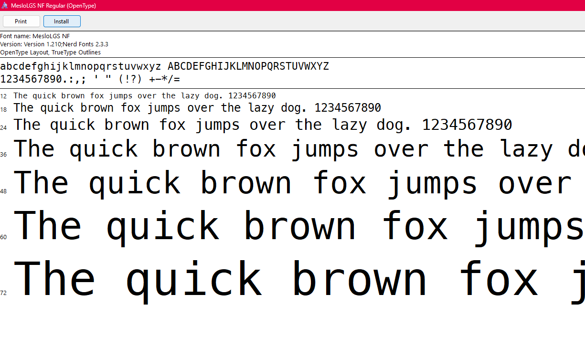
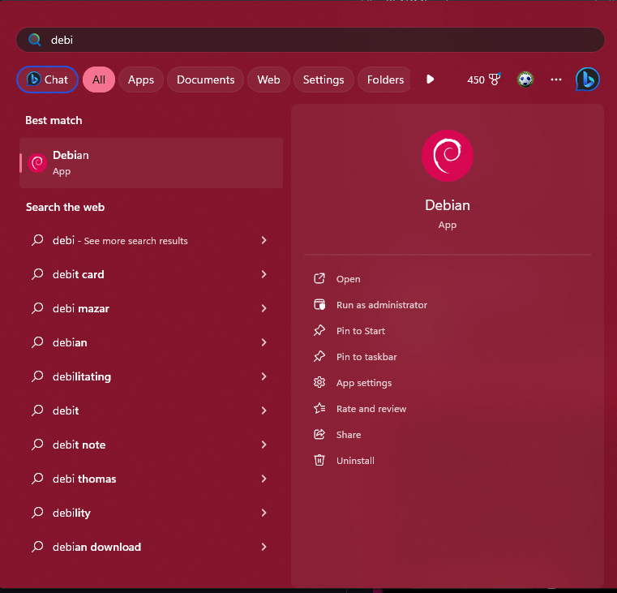
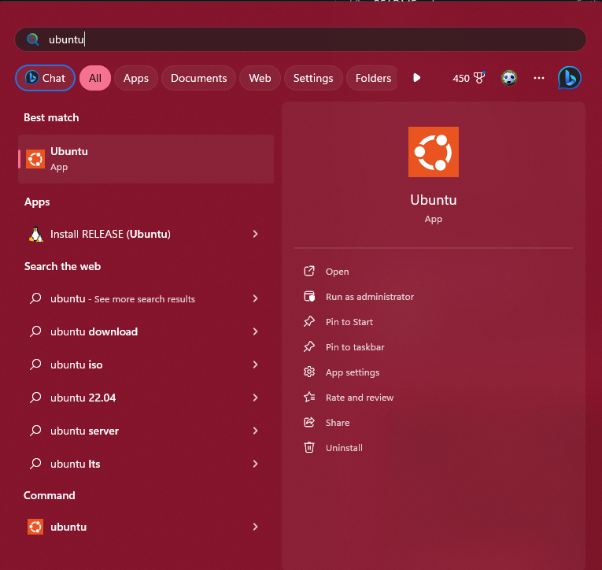
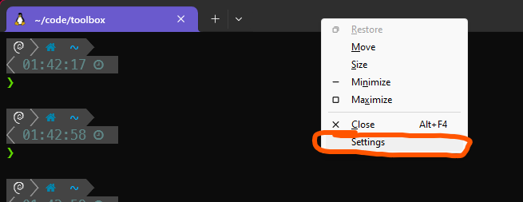
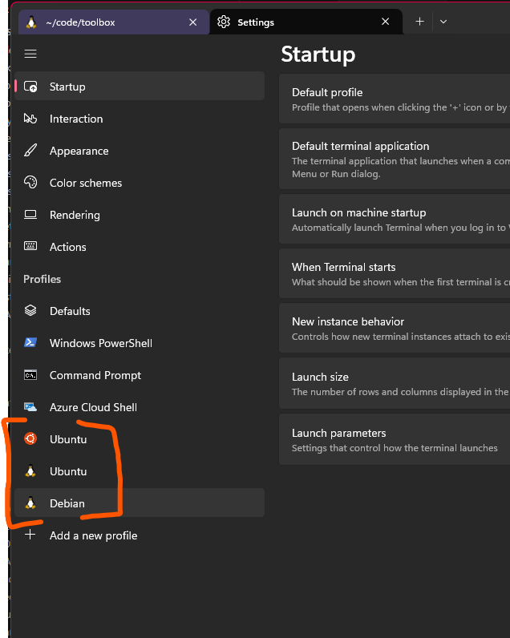
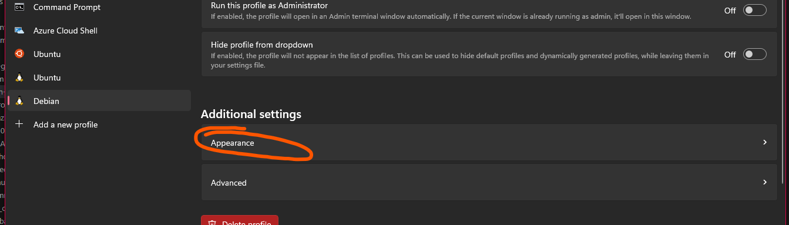
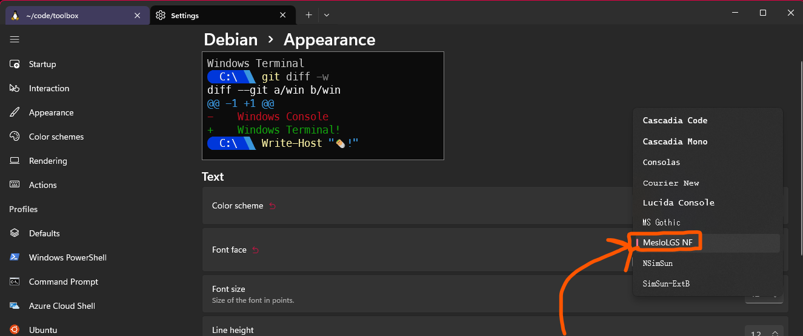

# Toolbox

---

My toolbox contains a series of configuration files, helper scripts, and automations to allow me to quickly configure an OSX or Linux environment.

## What's In This Repo?

```bash
├── bin/                                    # Helper scripts. Should be added to $PATH for user convenience.
├── docs/                                   # Additional documentation that supplements this `README.md`
├── dot/                                    # Dotfiles to configure a slew of programs and environments.
├── nixos/                                  # NixOS and nix-darwin configurations for all hosts.
├── secret/                                 # Secrets, such as passwords. Purposefully ignored by Git, and populated on each individual machine.
├── Brewfile                                # Describes which programs to install with Brew.
├── README.md                               # This documentation.
```

## How Do I Use This Repo?

See the [nixos/](nixos/) directory for NixOS and nix-darwin host configurations. Each host is managed declaratively via Nix flakes.

## Setting Terminal Font

### Windows 11

Since we do not do much developing on Windows, and may only use it to SSH into a remote Linux box, we will not be automating this much. Please follow these steps to get the fonts working on your Windows machine.

1. Navigate to [this URL](https://github.com/romkatv/powerlevel10k#manual-font-installation), and download `MesloLGS NF Regular.ttf`, `MesloLGS NF Bold.ttf`, `MesloLGS NF Italic.ttf`, and `MesloLGS NF Bold Italic.ttf`.
2. For each of the four `.ttf` files, double click them, which opens up a popup showing you sample text in your font. Click the `install` button in the right corner.



3. Open our WSL application, which is usually called `Debian` or `Ubuntu.`





4. Right click on the top of the terminal, and navigate to `Settings`



5. Then navigate to `Profiles > Debian/Ubuntu` <sup>5</sup>



6. Then navigate to `Additional Settings/Appearance` <sup>6</sup>



7. Select `MesloLGS NF` from the `Font face` dropdown. <sup>7</sup>


