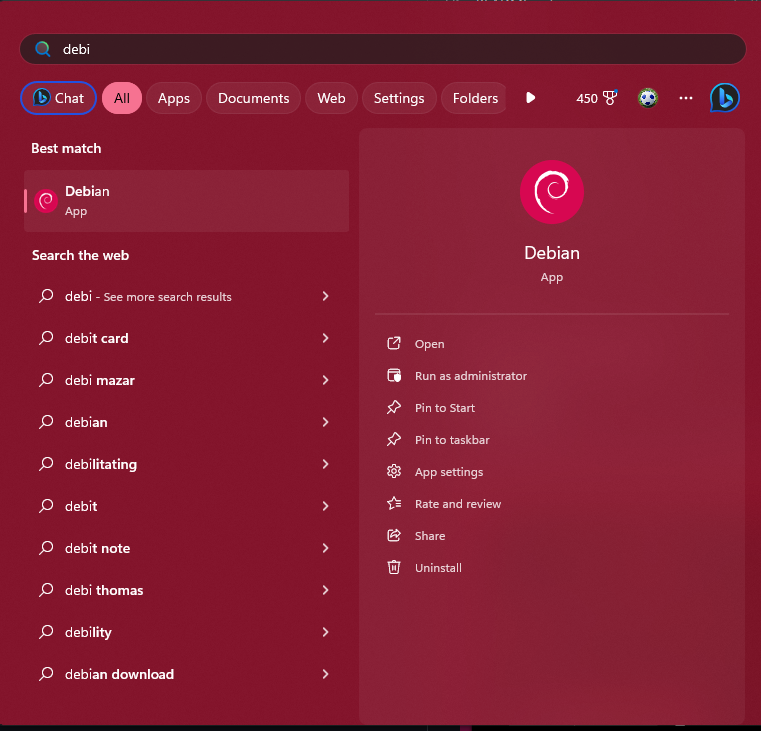

# Toolbox

---

My toolbox contains a series of configuration files, helper scripts, and automations to allow me to quickly configure an OSX or Linux environment.

## What's In This Repo?

```bash
├── ansible/                                # Ansible playbooks for automation.
├── bin/                                    # Helper scripts. Should be added to $PATH for user convenience.
├── docker/                                 # Contains all scripts related to using Docker to easily test out this toolbox in a throwaway environment.
├── docs/                                   # Additional documentation that supplements this `README.md`
├── dot/                                    # Dotfiles to configure a slew of programs and environments.
├── secret/                                 # Secrets, such as passwords. Purposefully ignored by Git, and populated on each individual machine.
├── bootstrap.sh                            # Optional precursor to install.sh for barebones systems, which prepares an environment for install.sh to be ran.
├── Brewfile                                # Describes which programs to install with Brew.
├── install.sh                              # Main entrypoint to leverage this Toolbox to configure an environment just the way I like it.
├── README.md                               # This documentation.
```

## How Do I Use This Repo?

First, you probably want to fork this repo, and take a look at `ansible/variables/`. These files are where you'll be able to configure:

1. Which apt repositories are added
2. Which apt packages are installed
3. Which flatpak repositories are added
4. Which flatpak packages are installed
5. Which directories are created for dot files to live in
6. Where we symbolically link dot files to

Then, it's as easy as:

```bash
$ ./install.sh
```

If you're on a barebones system, like alpine linux, use `$ ./bin/bare_bones.sh` fire, to prepare your system for the `install.sh` script.

And that's it! You can run the `install.sh` script again to upgrade packages, or apply any new changes you've made to the repository.

### How To Run In An Ephemeral Environment

To run this toolbox in an ephemeral environment, I suggest running it in a barebones Docker container. In this repo you'll find the `docker/` directory which house  barebones containers and scripts to assist with this. See `docker/README.md` for further instructions.

## My Application Installation Preferences

### OSX

Generally, I'll install everything using Brew.

### Linux

Since Linux has many different ways to install something, from your package manager, snap, flatpak, brew, compile from source, etc...,  I've decided on these preferences for installing software:

1. Via the default package manager. For Debian based distributions this would be `apt`.
2. Flatpak (via flathub).
3. A raw binary. Which we'll store in `~/Apps` and symlink them to `~/bin`.
4. clone and build

I've decided against using Snap, due to its widespread criticism.

## Setting Terminal Font

### Windows 11

Since we do not do much developing on Windows, and may only use it to SSH into a remote Linux box, we will not be automating this much. Please follow these steps to get the fonts working on your Windows machine.

1. Navigate to [this URL](https://github.com/romkatv/powerlevel10k#manual-font-installation), and download `MesloLGS NF Regular.ttf`, `MesloLGS NF Bold.ttf`, `MesloLGS NF Italic.ttf`, and `MesloLGS NF Bold Italic.ttf`.
2. For each of the four `.ttf` files, double click them, which opens up a popup showing you sample text in your font. Click the `install` button in the right corner.


3. Open our WSL application, which is usually called `Debian` or `Ubuntu.`




4. Right click on the top of the terminal, and navigate to `Settings`


5. Then navigate to `Profiles > Debian/Ubuntu` <sup>5</sup>


6. Then navigate to `Additional Settings/Appearance` <sup>6</sup>


7. Select `MesloLGS NF` from the `Font face` dropdown. <sup>7</sup>


## References

1. https://www.lorenzobettini.it/2023/07/my-ansible-role-for-oh-my-zsh-and-other-cli-programs/

## TODO

1. [ ] Consider looking into Ansible roles to simplify some of the custom things we've done here
2. [ ] Look into using [Molecule](https://ansible.readthedocs.io/projects/molecule/), instead of our adhoc throwaway Docker container
